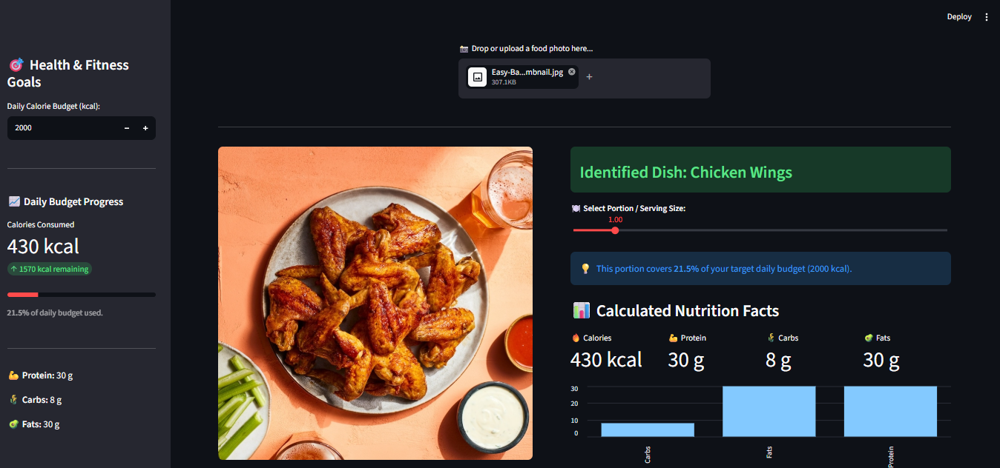

# 🥗 NutriVision AI — Deep Learning Food Recognition & Nutrition Tracker

<p align="center">


</p>

<p align="center">
<b>AI-powered Food Recognition, Nutrition Estimation, and Daily Macro Tracking using Transfer Learning.</b>
</p>

---

# 📌 Overview

**NutriVision AI** is an end-to-end Deep Learning application that recognizes food items from images and estimates their nutritional information using **Transfer Learning with EfficientNetB0**.

The application allows users to upload food images, predicts the food category, displays confidence scores, dynamically scales nutritional values according to serving size, tracks daily calorie intake, and exports meal logs for future analysis.

The project demonstrates practical implementation of **Computer Vision**, **Transfer Learning**, **Image Classification**, and **Interactive AI Application Development** using **TensorFlow** and **Streamlit**.

---

# 📷 Application Preview

## 🏠 Home Page

<p align="center">

</p>

---

## 🍽️ Food Recognition & Nutrition Prediction

<p align="center">

</p>

---

## 📊 Daily Nutrition Tracker

<p align="center">

</p>

---

# ✨ Key Features

- 🍕 Classifies **101 different food categories**
- 🤖 Transfer Learning using **EfficientNetB0**
- 📊 Displays **Top-3 Prediction Confidence Scores**
- 🥗 Calculates Calories, Protein, Carbohydrates and Fats
- ⚖️ Dynamic Serving Size Adjustment
- ⚠️ Low Confidence Manual Food Selection
- 📅 Daily Meal Journal
- 🎯 Daily Calorie Budget Tracking
- 📈 Live Nutrition Dashboard
- 📄 Export Meal Logs to CSV
- 🌐 Interactive Streamlit User Interface

---

# 🛠️ Technology Stack

## Programming Language

- Python 3.10+

## Deep Learning Framework

- TensorFlow 2.x
- Keras

## Computer Vision

- OpenCV
- Pillow (PIL)

## Web Application

- Streamlit

## Data Processing

- NumPy
- Pandas

## Visualization

- Matplotlib

## Dataset

- Food-101 Dataset

---

# 🧠 Machine Learning Techniques Used

### ✅ Transfer Learning

Utilized the pre-trained **EfficientNetB0** architecture trained on ImageNet for efficient feature extraction.

---

### ✅ Fine-Tuning

Fine-tuned higher layers of EfficientNetB0 to improve classification performance on Food-101.

---

### ✅ Data Augmentation

Applied various augmentation techniques including:

- Random Horizontal Flip
- Random Rotation
- Random Zoom
- Random Contrast
- Random Brightness

to improve model generalization and reduce overfitting.

---

### ✅ Image Preprocessing

- Resize images to **224 × 224**
- Convert images into tensors
- Normalize pixel values
- Batch processing using TensorFlow pipelines

---

### ✅ Multi-Class Image Classification

Performed classification across **101 food categories** using:

- Softmax Activation
- Categorical Crossentropy Loss

---

### ✅ Top-K Prediction

Extracted the **Top-3 predictions** with confidence probabilities for improved interpretability.

---

### ✅ Nutrition Estimation

Mapped predicted food categories to nutritional values including:

- Calories
- Protein
- Carbohydrates
- Fat

---

### ✅ Dynamic Portion Scaling

Scaled nutrition values in real-time according to user-selected serving size.

---

### ✅ Session-Based Meal Tracking

Maintained meal history during the active session and computed cumulative nutritional intake.

---

# ⚙️ Deep Learning Pipeline

```text
Food Image
     │
     ▼
Image Upload
     │
     ▼
Image Preprocessing
     │
     ▼
Resize (224×224)
     │
     ▼
EfficientNetB0
     │
     ▼
Softmax Classification
     │
     ▼
Top-3 Predictions
     │
     ▼
Nutrition Database
     │
     ▼
Serving Size Scaling
     │
     ▼
Meal Logger
     │
     ▼
CSV Export
```

---

# 📂 Dataset

The project uses the **Food-101 Dataset**.

### Dataset Statistics

- 🍔 101 Food Categories
- 📷 101,000 Images
- 🖼️ 750 Training Images per Class
- 🖼️ 250 Testing Images per Class

Dataset Link:

https://data.vision.ee.ethz.ch/cvl/datasets_extra/food-101/

---

# 📊 Model Details

| Parameter | Value |
|------------|--------|
| Architecture | EfficientNetB0 |
| Learning Strategy | Transfer Learning |
| Framework | TensorFlow/Keras |
| Classes | 101 |
| Image Size | 224 × 224 |
| Optimizer | Adam |
| Loss Function | Categorical Crossentropy |
| Output Activation | Softmax |

---

# 📁 Project Structure

```text
PRODIGY_ML_05
│
├── app
│   ├── app.py
│   └── predictor.py
│
├── dataset
│   └── calories.csv
│
├── model
│   └── best_finetuned_model_gpu.keras
│
├── output
│   ├── home_page.png
│   ├── prediction_result.png
│   └── nutrition_tracker.png
│
├── utils
│   ├── preprocess.py
│   └── nutrition_data.py
│
├── predict.py
├── train.py
├── requirements.txt
├── README.md
└── .gitignore
```

---

# 🚀 Installation

## Clone Repository

```bash
git clone https://github.com/tripathipravardhan/PRODIGY_ML_05.git
```

```bash
cd PRODIGY_ML_05
```

## Install Dependencies

```bash
pip install -r requirements.txt
```

## Run the Application

```bash
streamlit run app/app.py
```

---

# 📈 Future Improvements

- Multiple Food Detection
- YOLOv8-based Food Localization
- Barcode Scanner Integration
- Weekly Nutrition Reports
- BMI & Health Recommendations
- User Authentication
- Cloud Database Integration
- Mobile App Deployment

---

# 👨‍💻 Author

**Pravardhan Tripathi**

Machine Learning • Deep Learning • Computer Vision

GitHub:
https://github.com/tripathipravardhan
LinkedIn:
https://www.linkedin.com/in/pravardhan-tripathi-a8a5ab37a

---

# 🙏 Acknowledgements

- TensorFlow
- Keras
- Streamlit
- OpenCV
- Food-101 Dataset
- EfficientNet Research Team

---

# ⭐ Support

If you found this project useful, consider giving it a ⭐ on GitHub!
